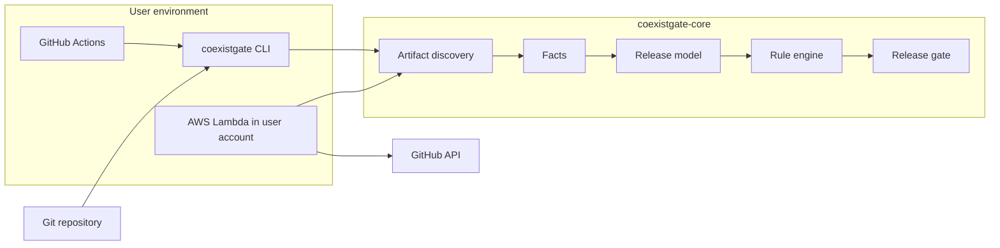
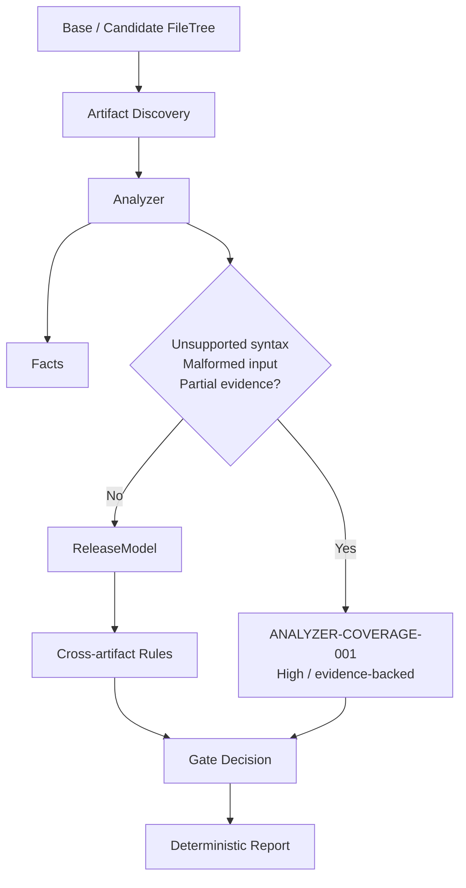

# Architecture — CoexistGate V0.1

SSOT: [`GOAL.md`](../GOAL.md). This file describes what is implemented, not a future platform.

## Context



Core never imports GitHub, Lambda, or HTTP types.

## Pipeline

```text
Inputs
  → Artifact Discovery
  → Facts
  → Release Model
  → Cross-Artifact Rules
  → Findings
  → Release Gate
  → Report
```

### 결정 경계: 분석 불확실성은 PASS가 아니다



분석기는 사실(`facts`)과 불확실성(`issues`)을 별도로 반환합니다. 지원 대상 파일을 조용히 건너뛰면 안전을 증명할 수 없으므로, 불확실성은 파일·라인·사유를 증거로 가진 `ANALYZER-COVERAGE-001` finding으로 변환되어 기본 `high` 임계값에서 게이트를 차단합니다. 정상적으로 지원하지 않는 영역인 baseline `CREATE TABLE` 선언이나 Helm 템플릿은 이 계약의 대상이 아닙니다.

### Inputs

`AnalysisRequest`:

- `previous`: file tree at base (previous release)
- `candidate`: file tree at head / working copy
- `policy`: parsed `.coexistgate.yml` (candidate, fallback previous)
- `changed_paths`: optional hint; discovery still may load previous app/config needed by rules

Trees are `BTreeMap<path, bytes>` so iteration is deterministic.

### Discovery

Classifies files by path/extension. Skips `.git`, `node_modules`, `target`, `dist`, `vendor`, files over 1 MiB.

Does not parse the whole world when a change set exists: always load candidate + previous files that analyzers mark as **needed** (application/config when migrations or env files changed; deploy manifests when policy/availability rules run).

### Analyzers

| Analyzer | Emits |
| --- | --- |
| Migration | PostgreSQL DDL schema operations |
| Application | TS/JS `table.column` and env references |
| Deployment | K8s Deployment + Compose strategy, replicas, resources, env |
| Configuration | `.env*` keys |

Analyzers implement:

```text
fn id() -> &'static str
fn analyze(tree) -> AnalysisOutput { facts, issues }
```

`issues`는 파서 오류나 지원하지 않는 변경 문법처럼 분석 범위를 벗어난 입력을 나타냅니다. 엔진은 이를 일반 rule override로 끌 수 없는 고정 high finding으로 바꾸므로, 정책 완화가 분석 공백을 숨기지 못합니다.

Core holds a registry. Adding an analyzer does not change the rule engine.

### Release model

Two snapshots of facts plus policy:

- Previous application references vs candidate schema (rolling + rollback)
- Previous application env vs candidate deploy/config contract (rollback)
- Candidate application env vs candidate deploy (forward)
- Candidate replicas/resources vs policy (and optional no-regression vs previous manifest)

### Rules

Pure functions `ReleaseModel -> Vec<Finding>`. No I/O. Sorted by `(rule_id, first evidence path, line)` before emit.

### Gate

`fail_on` severities (policy or CLI). Finding severity after per-rule overlay (`error` / `warning` / `off`).

`REVIEW` is not a separate gate state in V0.1: unused expand-only schema changes simply produce **no blocking finding** (PASS). Medium findings without `fail_on: medium` also PASS the gate.

## Crate map

```text
coexistgate-core      models, discovery, analyzers, rules, gate, report
coexistgate-cli       git trees, flags, human/JSON output, exit codes
coexistgate-github    webhook HMAC, zipball trees, Check Run formatting
coexistgate-lambda    HTTP entry; calls github + core only
```

Analyzers live in `coexistgate-core` as modules (not a plugin ABI). A second analyzer must not force a core rewrite; it must not require one either.

## Adapters

```text
Event → Adapter → AnalysisRequest → Core → Report
```

GitHub adapter:

1. Verify signature
2. Ignore non-PR or closed PRs
3. Fetch base and head zipballs (not a CoexistGate SaaS cache)
4. Run core
5. Create Check Run `CoexistGate / Release Safety`

Lambda adds: size limits, timeout, no body-content logging, path-zip-slip checks.

## Website

Static HTML in `website/`. No API, no auth. It is not part of core.

## Non-goals in this diagram

No event bus, no org database, no LLM judge, no dashboard.
